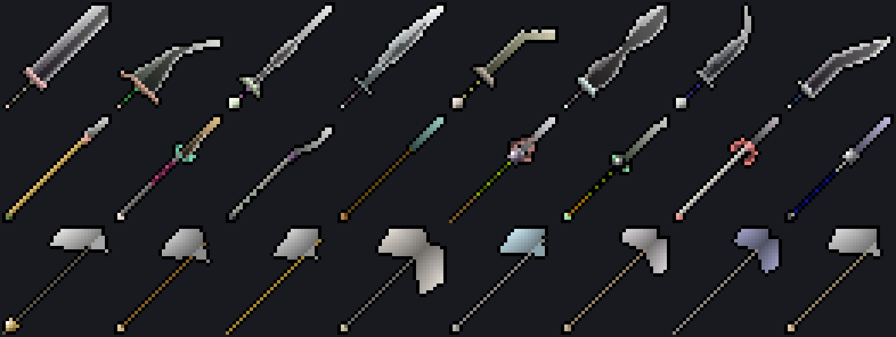

# pixel-icons

Procedural pixel-art **weapon icons**, drawn on a plain 2D canvas — no image assets, no AI.

Three generators — **blades**, **spears**, and **axes** — each built from traditional procedural algorithms (curved blade cores, tapered crossguards, wound grips, hafts, round ornaments, and flared axe bits). Every icon is fully determined by a string **seed**, so the same seed always produces the same icon on every device.

> `blades` and `spears` are ports of Brian MacIntosh's Icon Machine; `axes` is an original generator added in this project (haft + procedural axe head).



---

## Features

- **Pure canvas 2D** — no WebGL, no Three.js, no sprite sheets
- **Deterministic** — same `seed` + class → same icon everywhere; safe to store in a database
- **Three generators** — `blades`, `spears`, `axes`, plus meta-selectors `anyweapon` and `any`
- **Pixel-perfect** — renders at a native resolution (default 32×32) and scales up with `image-rendering: pixelated`
- **React component included** — `<WeaponIcon>` with zero configuration; framework-agnostic core if you don't use React
- **Tree-shakeable** — generator core, React component, and math utilities are separate exports

---

## Installation

```bash
pnpm add pixel-icons
# React is an optional peer dependency
pnpm add react
```

---

## Quick start

### React

```tsx
"use client"; // Next.js only — omit for Vite / plain React
import { WeaponIcon } from "pixel-icons/react";

export function MyIcon() {
  return <WeaponIcon config={{ seed: "excalibur", iconClass: "anyweapon" }} size={64} />;
}
```

### Vanilla (no framework)

```ts
import { generateIcon } from "pixel-icons";

const canvas = document.getElementById("icon") as HTMLCanvasElement;
canvas.width = canvas.height = 32;
const ctx = canvas.getContext("2d")!;

// Returns the concrete class actually drawn (useful when using a meta-selector).
const drawn = generateIcon(ctx, 32, { seed: "excalibur", iconClass: "anyweapon" });
```

---

## IconConfig

The only value you need to persist.

```ts
interface IconConfig {
  /** String seed. Drives every procedural choice. */
  seed: string;
  /** "blades" | "spears" | "axes" | "any" | "anyweapon" */
  iconClass: IconClassSelector;
}
```

- `blades` / `spears` / `axes` — draw that specific category.
- `anyweapon` / `any` — deterministically pick one of `blades` / `spears` / `axes` from the seed.

---

## API

### `generateIcon(ctx, dimension, config)`

Draws into an existing 2D context at the current translation. Returns the concrete `IconClass` drawn.

### `new IconGenerator(ctx, dimension)`

Reusable generator bound to a context. Call `.generate(config)` per icon.

### `<WeaponIcon>` (React)

```tsx
<WeaponIcon
  config={{ seed: "abc", iconClass: "anyweapon" }}
  size={32}        // display size in CSS px (default 32)
  dimension={32}   // native render resolution (default 32)
  className="..."  // forwarded to the <canvas>
/>
```

### `randomIcon(selector?)` / `randomIconOfClass(class)`

Generate a random `IconConfig` using `Math.random()` — for "reroll" buttons, not deterministic generation.

---

## Credits

This is a TypeScript port of [**Icon Machine**](https://github.com/BrianMacIntosh/icon-machine) by [**Brian MacIntosh**](https://www.brianmacintosh.com/), originally written in JavaScript. All of the procedural drawing algorithms — blade cores, crossguards, grips, hafts, and round ornaments — are his work. (His original also generates potions; only the weapon generators are ported here.) This package translates that logic to standalone TypeScript with the DOM/UI stripped out, so it can be embedded as a library.

Please support and credit the original author.

---

## License

**GPL-3.0-or-later**, matching the license of the original Icon Machine source code.

> Note: as in the original project, the *source code* is GPL-licensed, but the pixel-art icons it *generates* are released as [CC0](https://creativecommons.org/publicdomain/zero/1.0/) — you can use generated icons freely in any project.
